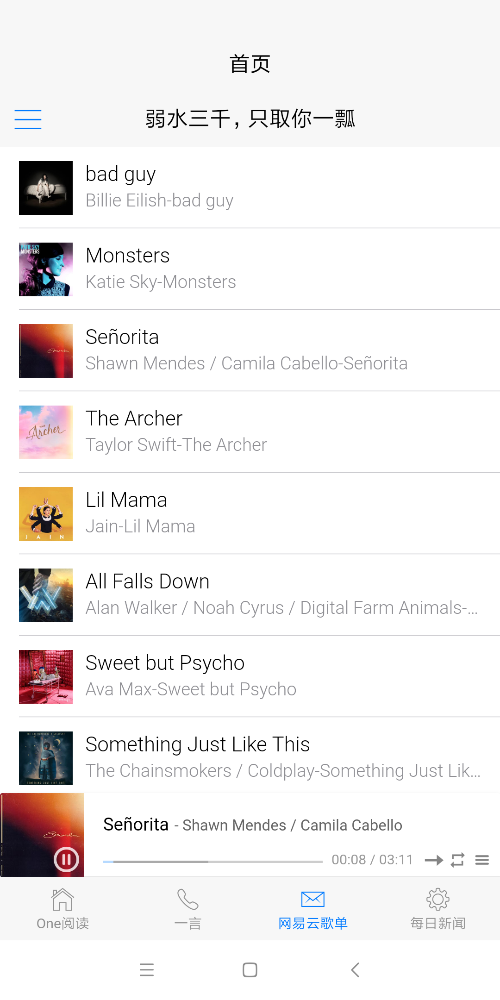

# mui-app
> 这个项目是用来技术研究的。如有侵权，联系立删

### 关于开发语言
> 骄傲的使用 `javaScript`,由于不想写太多的css，就使用了 `DCloud` 公司的 `mui`的代码片段

### 关于打包
> 可以下载之后使用 `HBuilderX`进行云打包查看

### 关于请求
> 主要使用 `fetch` 请求，当在 `fetch`请求 `jsonp`数据的时候，使用了 [**`fetch-jsonp`**](https://github.com/camsong/fetch-jsonp) 这个库

### 关于页面数据接口
这里首先感谢伟大的开源社区
> 所有的数据都来自网上的开源**`api`**，`api`的介绍，代码里都有的